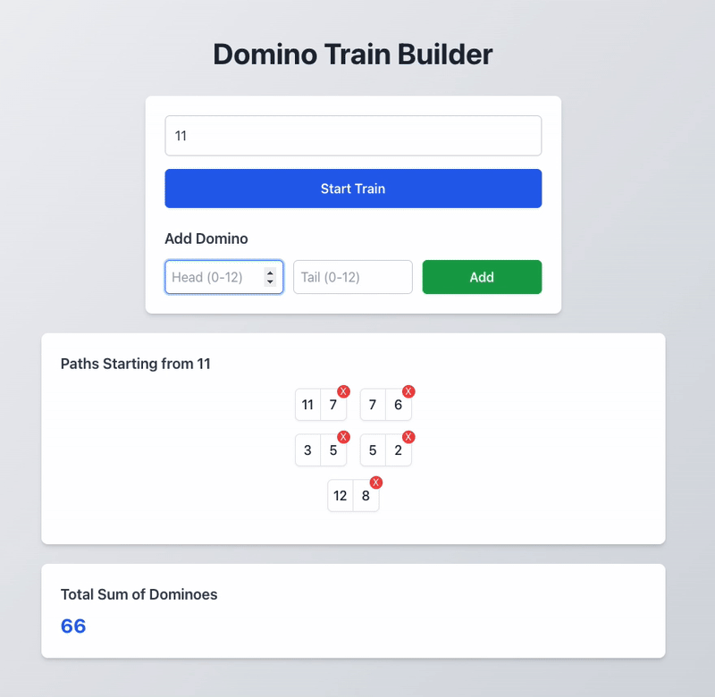
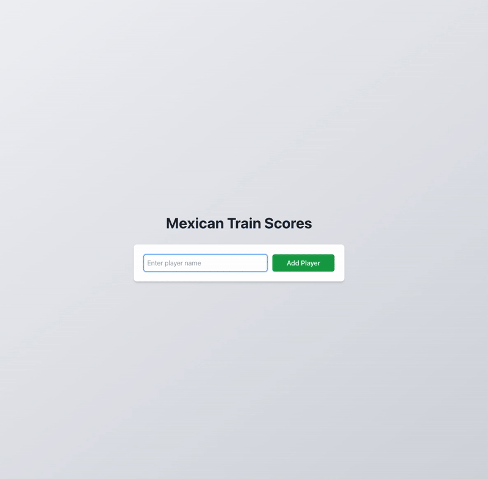

# Domino Train Builder

A web application for building and organizing domino trains, specifically designed for playing Mexican Train Dominoes. The app helps players visualize possible domino combinations and tracks game scores.

## Demo

### Adding and Removing Dominoes

Below is a demonstration of adding and removing dominoes in the app:



### Score Tracking

Below is a demonstration of the score tracking functionality:



## Features

- Interactive domino train building
- Automatic train organization and optimization
- Score tracking for multiple players
- Support for different domino set sizes (9, 12, 15, or 18)
- Persistent storage of game state
- Responsive design for desktop and mobile

## How It Works

### Train Building Algorithm

The core train-building logic uses a backtracking algorithm implemented in [`findBestPath`](app/utils/dominoUtils.js) that:

1. Finds the longest possible sequence of connected dominoes
2. Optimizes the orientation of dominoes based on:
   - A fixed starting value (if specified)
   - Distribution of values to balance the train

The [`orientPath`](app/utils/dominoUtils.js) function handles the orientation optimization by:
- Ensuring trains start with the specified value when possible
- Balancing the distribution of values across the first and second half of the train
- Maintaining consistent display of double-sided dominoes

### Score Management

The scoring system supports:
- Multiple players
- Round-by-round score tracking
- Automatic score totaling
- Score persistence between sessions

## Getting Started

First, run the development server:

```bash
npm run dev
# or
yarn dev
# or
pnpm dev
# or
bun dev
```

Open [http://localhost:3000](http://localhost:3000) with your browser to see the result.

## Technologies Used

- **Next.js** - Framework for server-rendered React applications.
- **Tailwind CSS** - Utility-first CSS framework for styling.
- **Local Storage** - Used for persisting game state and scores.

## Project Structure

- `/app` - Main application code
  - `/components` - React components
  - `/contexts` - Context providers
  - `/hooks` - Custom React hooks
  - `/utils` - Utility functions including domino algorithms
  - `/scores` - Score tracking interface

## Development

The project uses a modern React stack with client-side state management and modular components. All state is persisted to localStorage for seamless game continuation between sessions.