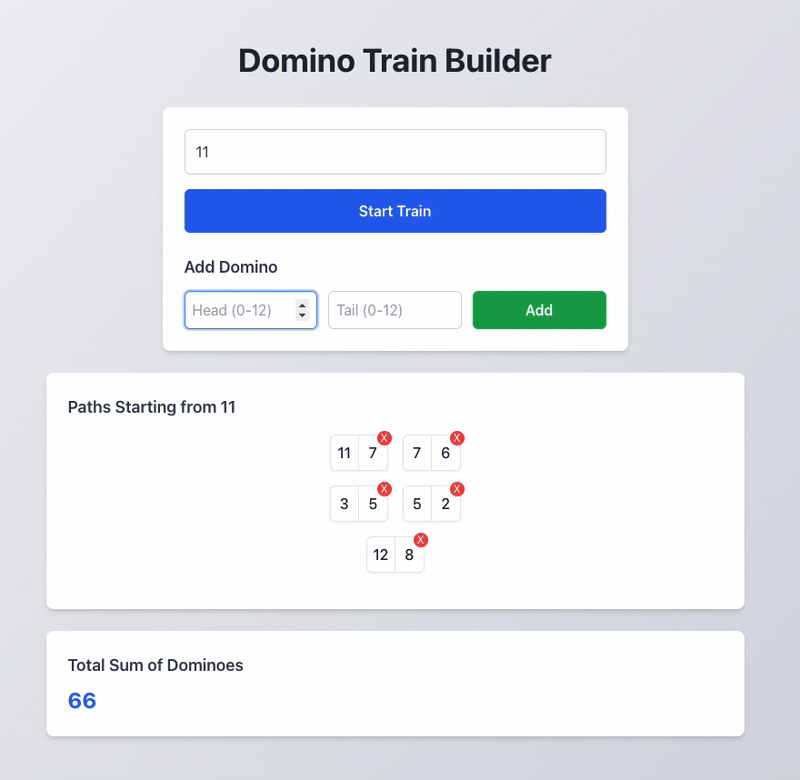
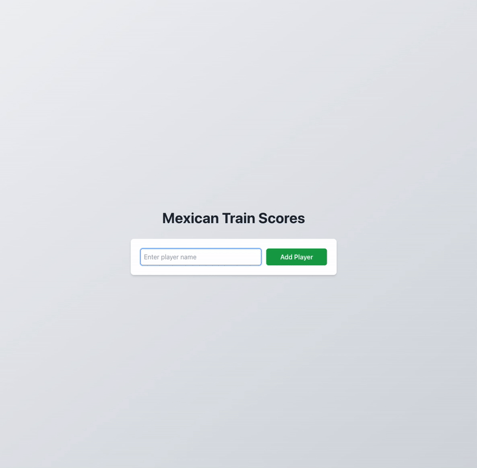

# Domino Train Builder

A web application for building and organizing domino trains, specifically designed for playing Mexican Train Dominoes. The app helps players visualize possible domino combinations and tracks game scores.

## Demo

### Adding and Removing Dominoes

Below is a demonstration of adding and removing dominoes in the app:



### Score Tracking

Below is a demonstration of the score tracking functionality:



## Features

- Interactive domino train building
- Automatic train organization and optimization
- Score tracking for multiple players
- Support for different domino set sizes (9, 12, 15, or 18)
- Persistent storage of game state
- Light and dark themes, following your system preference by default
- Responsive design for desktop and mobile

## How It Works

### Train Building Algorithm

The core train-building logic lives in [`findBestPath`](app/utils/dominoUtils.js), a depth-first search that:

1. Finds the longest possible sequence of connected dominoes, breaking ties by the highest pip total
2. Optimizes the orientation of dominoes based on:
   - A fixed starting value (if specified)
   - Distribution of values to balance the train

Searching every path exhaustively is exponential, so the search keeps only the best train found rather than collecting all of them, and prunes with a transposition table: arriving at the same value with the same set of dominoes already used always allows the same continuations and carries the same pip sum, so the repeat is skipped. It stops early once a train uses every tile, and caps the number of states it will expand, so an unusually well-connected hand returns a good train instead of hanging the page.

The [`orientPath`](app/utils/dominoUtils.js) function handles the orientation optimization by:
- Ensuring trains start with the specified value when possible
- Balancing the distribution of values across the first and second half of the train
- Maintaining consistent display of double-sided dominoes

### Score Management

The scoring system supports:
- Multiple players
- Round-by-round score tracking
- Automatic score totaling
- Score persistence between sessions

## Getting Started

First, run the development server:

```bash
npm run dev
# or
yarn dev
# or
pnpm dev
# or
bun dev
```

Open [http://localhost:3000](http://localhost:3000) with your browser to see the result.

Run the tests with:

```bash
npm test
```

## Technologies Used

- **Next.js** - Framework for server-rendered React applications.
- **React** - Component model and client-side state.
- **Tailwind CSS** - Utility-first CSS framework for styling.
- **Vitest** - Test runner for the path-finding utilities.
- **Local Storage** - Used for persisting game state and scores.

## Project Structure

- `/app` - Main application code
  - `/components` - React components
  - `/contexts` - Context providers
  - `/hooks` - Custom React hooks
  - `/utils` - Utility functions including domino algorithms
    - `/__tests__` - Tests for the path-finding logic
  - `/scores` - Score tracking interface

## Development

The project uses a modern React stack with client-side state management and modular components. All state is persisted to localStorage for seamless game continuation between sessions.

The path-finding utilities are covered by tests in [`app/utils/__tests__`](app/utils/__tests__), including a differential test that checks the optimized search against a straightforward brute-force implementation across randomly generated hands.